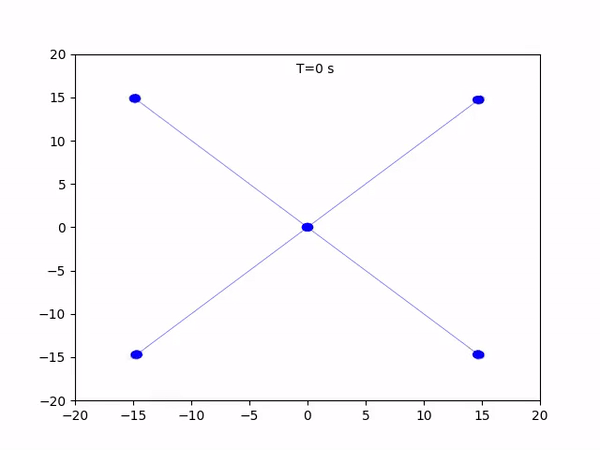

# Spiking Neural Network for time-varying Formation Control in multi-agent systems

This repository contains code to implement a Spiking Neural Network (SNN) for solving a time-varying formation control problem in multi-agent systems (MAS) using Norse. The SNN is trained to approximate and/or replicate a classical time-varying formation control algorithm while ensuring collision avoidance.

## What are Spiking Neural Networks (SNNs)?

Spiking Neural Networks (SNNs) are a type of artificial neural network that more closely mimic biological neurons compared to traditional neural networks. In SNNs, neurons communicate through discrete spikes or pulses, much like how biological neurons do in the brain. This temporally-rich communication method introduces a notion of time and allows SNNs to process temporal sequences more efficiently.

## What is Formation Control?

Formation control refers to the coordination strategy used in multi-agent systems (such as drones, robots, or autonomous vehicles) to maintain a desired formation during motion. The objective is to move multiple agents while ensuring they maintain certain relative positions to each other. This type of control is commonly used in applications such as robotics, autonomous vehicles, and swarm intelligence.

## What are Control Barrier Functions (CBFs)?

Control Barrier Functions (CBFs) are mathematical tools used to enforce safety constraints, such as collision avoidance in control systems. They ensure that agents in a multi-agent system avoid collisions with each other or obstacles by restricting certain unsafe control actions. In this project, CBFs are used only for the classical controllers to ensure collision-free movement of the agents, while we let the SNN-based controller learn the CBFs collision-free behaviour.

## Project Overview

The project aims to compare the classical formation control algorithm with a learned SNN-based approach. The task involves agents maintaining a desired formation while avoiding collisions. This project demonstrates the potential of neuro-inspired computation for solving engineering problems, such as multi-agent formation control.

### Key Features

- **Classical Formation Control**: a traditional method for controlling the position and trajectory of agents in a multi-agent system.
- **Spiking Neural Network (SNN) Formation Control**: a neural-inspired algorithm trained to mimic the classical control while introducing biological plausibility through spiking neurons.
- **Collision Avoidance**: both the classical and learned approaches incorporate collision avoidance strategies using Control Barrier Functions (CBFs).

## To Do

- [x] Setup repository, requirements, README and main structure.
- [x] Program classical formation controller using my master thesis code. Save data to train SNN.
- [x] Create a SNN for formation control and train and test accordingly.
- [X] Simulate both classical and SNN FC. Record video and write a short report.

## Installation

### 1. Clone the Repository

To start using the project, clone the repository from GitHub:

```
git clone https://github.com/ViktorNfa/SpikingNeuralNet_FormationControl.git cd SpikingNeuralNet_FormationControl
```

### 2. Set Up a Virtual Environment

It is recommended to use a virtual environment to manage dependencies:

Using `venv`:

```
python -m venv venv
source venv/bin/activate  # On Windows: venv\Scripts\activate
```

Or using `conda`:

```
conda create --name snn_env python=3.9
conda activate snn_env
```

### 3. Install Dependencies

Once inside the virtual environment, install the required dependencies:

```
pip install -r requirements.txt
```

## Results

### Video Demonstrations

Below are visual demonstrations of the formation control in action. These videos show the behavior of the multi-agent system using both the classical and SNN-based controllers:

- Classical Formation Control:


- SNN-based Formation Control:



### Collision Avoidance Comparison

Below are visual representations of the effectiveness of collision avoidance strategies in both the classical and SNN-based control systems (note that if the graph goes below zero the safety condition has not been fulfilled and a collision is likely to occur):

- Classical CBF Collision Avoidance:


- Learnt SNN CBF Collision Avoidance:


The graphs show the effectiveness of Control Barrier Functions in maintaining safe distances between agents. Notably the learnt agent can keep the safe condition with respect to the rest of the network.

## Discussion
The comparative analysis of the classical and SNN-based controllers gives us several key takeaways:

### Benefits of using SNN
There are three main benefits that come from the use of SNNs as opposed to the classical formation controller algorithms:
- Biological plausibility: SNNs emulate neuronal spiking behavior, providing a framework that is closer to biological neural processing. This could lead to more natural and efficient control strategies.
- Temporal processing: SNNs inherently handle temporal information, which can be advantageous in dynamic environments where timing is crucial.
- Energy efficiency: due to their event-driven nature, SNNs have the potential for lower power consumption, making them suitable for embedded systems and IoT devices, as opposed to the conventional formation controller. However, this depends on the advancement of neuromorphic processors and hardware, and how their performance compares to alternative CPU-based architectures.

### Drawbacks and challenges
The main drawback observed was the training complexity since SNNs require specialized training algorithms, such as surrogate gradient methods, which can be more complex and computationally intensive compared to traditional neural networks. Another important factor is the slight performance degradation shown by the minor increase in formation error and convergence time of the SNN controller, although more fine-tuning of the network parameters could be done to close this performance gap. Lastly, scalability might also be an issue since extending the SNN controller to handle a significantly larger number of agents may present challenges in terms of network size and training time.

### Interpretation of results
The SNN-based controller effectively learns the formation control task, achieving performance metrics close to the classical controller, and the absence of collision incidents suggests that the SNN successfully internalized the collision avoidance behavior without explicit CBF implementation. Furthermore, the slightly higher convergence time indicates that while the SNN approximates the classical controller well, there is room for optimization, possibly through deeper network architectures or additional training.

### Conclusion
This project demonstrates the viability of using Spiking Neural Networks for formation control in multi-agent systems. While the classical controller remains superior in terms of convergence speed, efficiency and theoretical guarentees, the SNN offers several advantages that could be beneficial in specific applications, especially when energy efficiency is prioritized. Future work should focus on optimizing the SNN architecture and training process to further enhance performance and to extend it to more diverse settings.

## Usage Instructions

- Classical Formation Control: run the classical formation control simulation with the following command:

```
python formation_control.py
```

- Dataset generator: run the dataset generator needed to train the network a:

```
python dataset_generator.py
```

- SNN Training: to train the Spiking Neural Network, execute:

```
python snn_training.py
```

- Simulation: once the SNN is trained, you can compare both controllers by running the simulation:

```
python simulation.py
```

## Future Work

- Extend the SNN to handle larger teams of agents.
- Investigate more complex formation control tasks.
- Explore different SNN architectures to improve learning efficiency.
  
## License

This project is licensed under the [LICENSE](LICENSE).

## Acknowledgments

This project was inspired by research into neuro-inspired computation and multi-agent systems, particularly by what was learnt in the PhD course *FDD3558 Solving Engineering Problems with Neural-inspired Computation* at KTH Royal Institute of Technology.

